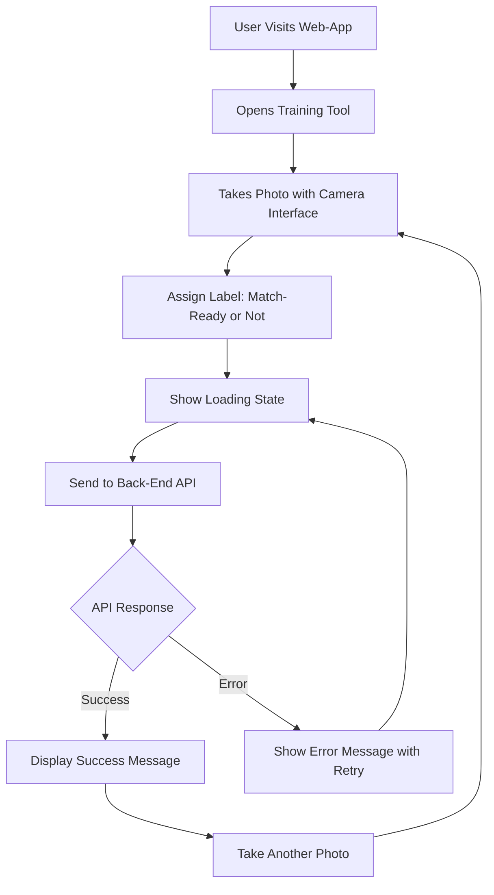

The front-end will have a optional training tool that allows users to upload images of cricket balls and manually label them as match-ready or not. This tool will be used to grow the dataset for training the neural network model. The user will be able to upload images, view them, and assign labels. The labeled images will be sent to the [[Back-End]] for storage and later manual review by the team.

## Implementation

The training tool is implemented in [`TrainView.vue`](../frontend/src/views/TrainView.vue). It allows users to:

- Capture a photo using the camera interface (['CameraComponent.vue'](../frontend/src/components/CameraComponent.vue))
- Label the image as "match ready" or "not match ready"
- Submit the labeled image to the backend `/training` endpoint
- See a success message or error, and retake or submit another photo

The UI provides clear feedback and uses the same responsive design and color scheme as the main prediction interface.