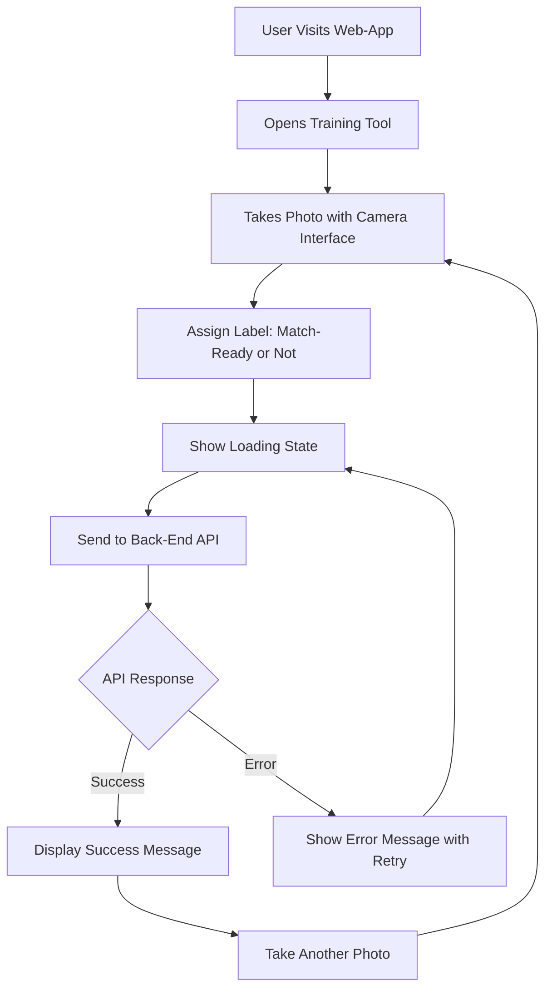

The front-end will have a optional training tool that allows users to upload images of cricket balls and manually label them as match-ready or not. This tool will be used to grow the dataset for training the neural network model. The user will be able to upload images, view them, and assign labels. The labeled images will be sent to the [[Back-End]] for storage and later manual review by the team.

