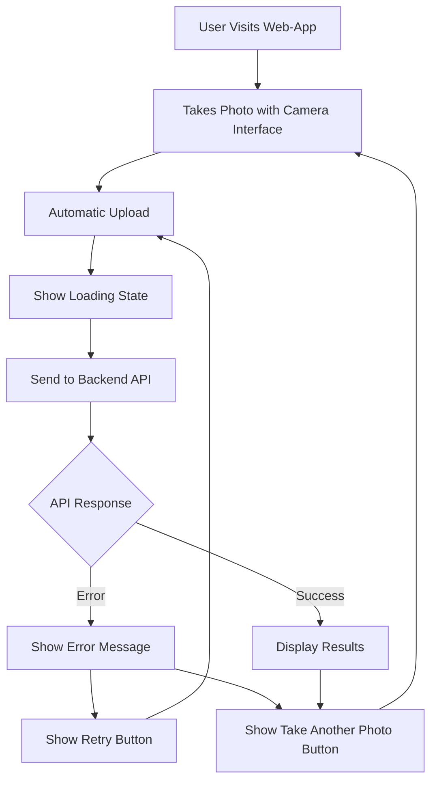
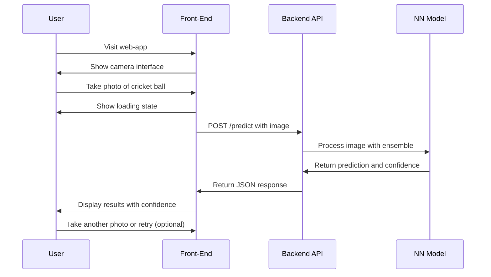
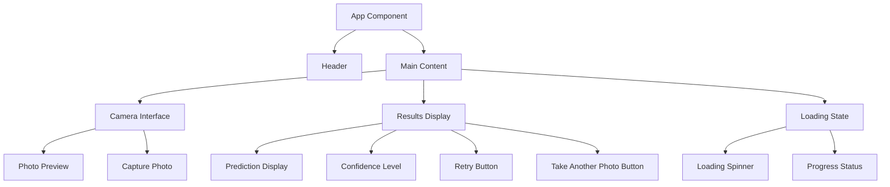

## Overview

The front-end of the Cricket-Ready Ball Classifier project is a web-app interface that allows users to upload images of cricket balls and receive predictions on whether the ball is match-ready or not. The interface is designed to be user-friendly and responsive, providing immediate feedback based on the uploaded image. It communicates with the back-end API to send the image data and receive the prediction results, which include the classification of the ball and the confidence level of the prediction.

## Technology Stack

- **Framework**: Vue.js
- **Styling**: CSS3
- **Deployment**: GitHub Pages

## User Interface Flow

## User Experience Flow

## Component Structure

## Key Features

### Upload and Capture Interface
- **Camera Interface**: Allows users to take photos directly from the web-app
- **Automatic Upload**: Photos are automatically uploaded to the back-end for processing on capture

### Results Display
- **Prediction Display**: Shows whether the ball is match-ready or not
- **Confidence Level**: Displays the confidence level of the prediction
- **Visual Feedback**: Colour-coded results (green for ready, red for not ready)
- **Image Display**: Shows the uploaded image alonside the results
- **Retry and Take Another Photo**: Options for users to retry the upload or take another photo

### User Experience
- **Responsive Design**: The interface is designed to work mainly on mobile devices, providing a seamless experience for users
- **Loading State**: Displays a loading spinner while the image is being processed
- **Error Handling**: Helpful error messages for failed uploads
- **Fast Performance**: Optimized images and minimal loading times for a smooth user experience

### Color Scheme
- **Primary Green**: `#2E7D32` (deep cricket field green)
- **Secondary Green**: `#4CAF50` (lighter green for buttons)
- **Accent Red**: `#C62828` (cricket ball red for "not-ready" states)
- **Background**: `#F8F9FA` (clean off-white)