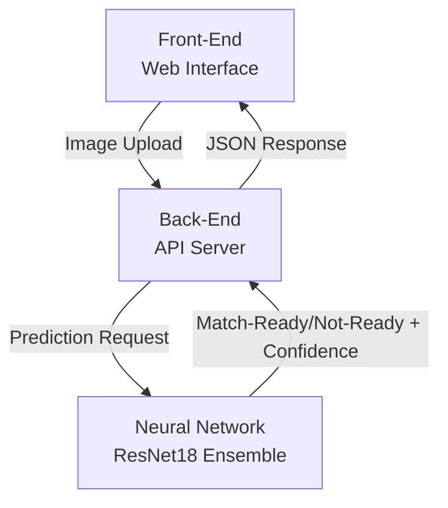

## Overview
Below is a simple high-level architecture diagram for the Cricket-Ready Ball Classifier project. It illustrates the main components and their interactions.
- **Front-End**: Web interface for users to upload images of cricket balls. Responses are displayed to the user to show whether the ball is match-ready or not, along with the confidence level.
- **Back-End**: API server that handles image uploads, processes the images, and interacts with the neural network for predictions.
- **Neural Network**: An ensemble of ResNet18 models that performs the classification of cricket balls as match-ready or not-ready based on the uploaded images.

